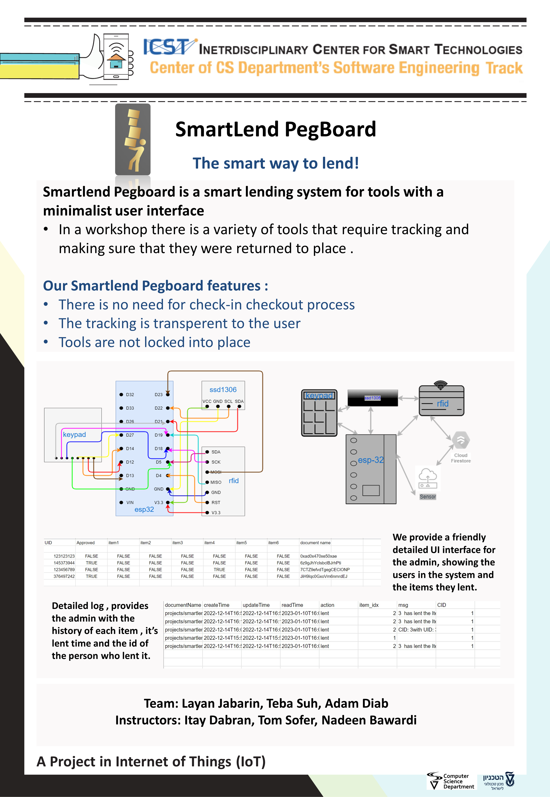

# SmartLend PegBoard

__*The smart way to lend!*__

Lending system for tools with a minimalist user interface.

__main features:__

- track who used the tools, and make sure they returned to place. 
- The tracking will be transparent to the user, without locking any tool in the cell.
- There is no need for check-in checkout process.

<b>Useful links</b>
<ul>

<li><a href="https://randomnerdtutorials.com/installing-the-esp32-board-in-arduino-ide-windows-instructions/">Installing the ESP32 Board in Arduino IDE (Windows, Mac OS X, Linux)</a>  </li>

<li><a href="https://www.aranacorp.com/en/using-an-rfid-module-with-an-esp32/">RFID - ESP32</a> </li>

<li><a href="https://github.com/mobizt/Firebase-ESP-Client">ESP32 – FireStore (examples->firestore)</a> </li>

<li><a href="https://learngitbranching.js.org/">Learn Git</a> </li>

</ul>

The project was made for the __236333 Internet Of Things__ Course at the [Technion Institue Of Technology](https://www.technion.ac.il/)

